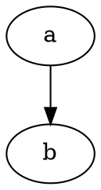

::: title-page
<!-- タイトルページ -->
# タイトル

所属：XXX YYY \
著者名：山田　太郎
:::

<!-- 目次 -->
[[toc]]

<!-- 本文 -->

# 大項目

ここに内容を書きます。

ここは段落です。

ここも段落です。

インラインの数式です。 $e^{i\pi}+1=0$
`「$」`の前後に空白が必要？

下の行は数式です。`「$$」`の前に空行が必要？

$$
e^{i\pi}+1=0
$$

\`\`\`mathだと数式にならない

```math
a_i
```

ここにソースコードを書いています

```ditaa
+---+
| a |
+---+
```



```plantuml
a -> b
b -> c
```


```python
import os
for file in os.listdir():
    print(file)
```

```html
<!DOCTYPE html>
<html lang="ja">
<head>
  <meta charset="UTF-8">
  <meta http-equiv="X-UA-Compatible" content="IE=edge">
  <meta name="viewport" content="width=device-width, initial-scale=1">
  <title></title>
</head>
<body>
```

</body>
</html>

## h2タグの見出し

### h3タグの見出し

## h2タグの見出し2

脚注をつけます。円周率は３ <span class="footnote">3.141592</span> ネイピア数は
<span class="footnote">2.71828</span>

これはテーブルです。

| 列名1 | 列名2 | 列名3 | 列名4 | 列名5 |
|-------|-------|-------|-------|-------|
| 項目  | 項目  | 項目  | 項目  | 項目  |
| 項目  | 項目  | 項目  | 項目  | 項目  |
| 項目  | 項目  | 項目  | 項目  | 項目  |
| 項目  | 項目  | 項目  | 項目  | 項目  |
| 項目  | 項目  | 項目  | 項目  | 項目  |

a

!!! note NOTE
これはnoteです
!!!

!!! info
これはinfoです
!!!

!!! warning
これはwarningです
!!!

!!! tip
これはtipです
!!!

!!! danger
これはdangerです
!!!

これは画像です。


長い文章です。\
長い文章です。\
長い文章です。\
長い文章です。\
長い文章です。\
長い文章です。\
長い文章です。\
長い文章です。\
長い文章です。\
長い文章です。\
長い文章です。\
長い文章です。\
長い文章です。\
長い文章です。\
長い文章です。\
長い文章です。\
長い文章です。\
長い文章です。\
長い文章です。\
長い文章です。\
長い文章です。\
長い文章です。\
長い文章です。\
長い文章です。\
長い文章です。\
長い文章です。\
長い文章です。\
長い文章です。\
長い文章です。\
長い文章です。\
長い文章です。\
長い文章です。


大項目2
=======

へろーわーるど aaa

大項目3
=======

## aaaaa

